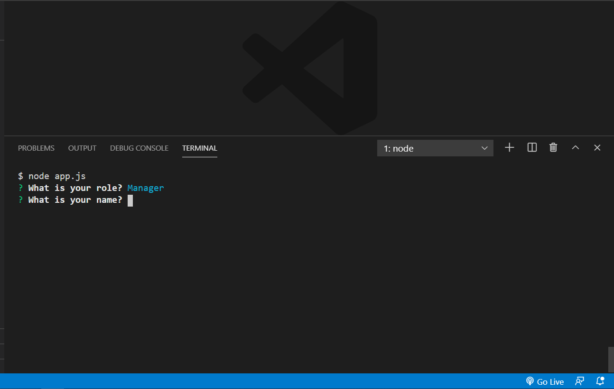

# Team Generator 
        
## Discription 
This is a command line application that renders an html file that displays a team of employees and their roles.
        
## Table of Contents 
* [Installation](#Installation)
        
* [Installation](#Installation)
        
* [Usage](#Usage)
        
* [License](#License)
        
* [Contributing](#Contributing)
        
* [Tests](#Tests)
        
* [Questions](#Questions)
        
## Installation 
node app.js
        
## Usage 

        
## License 
MIT
        
## Contributing 
Allan
        
## Tests 
Jest
        
## Questions 
[chefbrams](https://github.com/chefbrams)
         
Contact me by email with any further questions.
        
oldcitycatering@gmail.com  

        